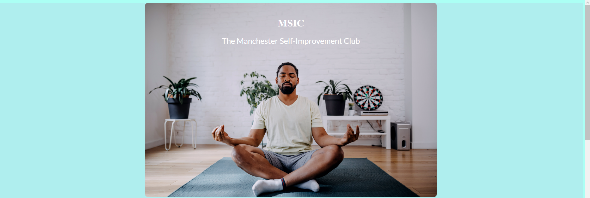
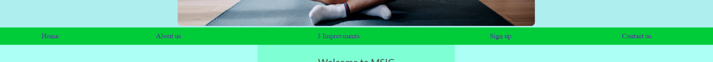
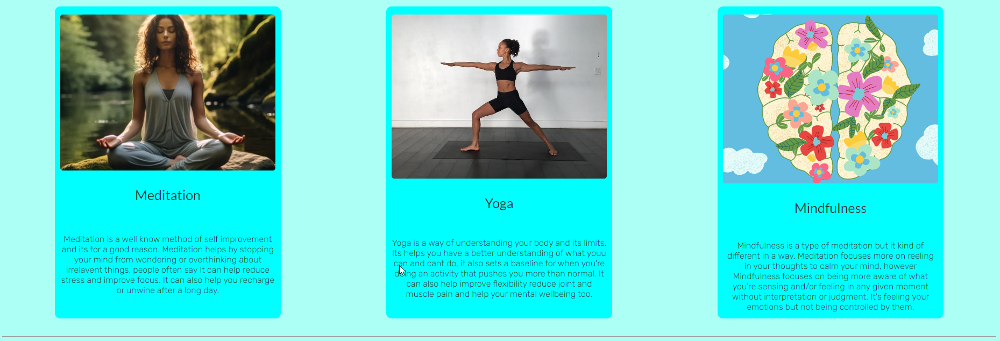
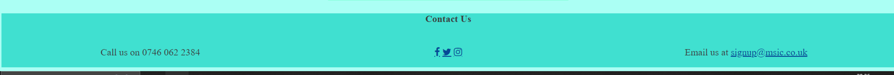

<h1>The Manchester Self-Improvement Club</h1>
The Manchester Self-Improvement Club or MISC for short is a landing page for people looking to improve themselves. The MISC offer a guide in 3 different methods of self-improvement.

Users of this website will be able to learn more about the 3 methods: what benifits they can expect, what area each of the methods with cover, contact information and a sign up form. The site is targeted towards people who want to learn more about self-improvement.

    

<h2>Features</h2>

    
    <ul>  
        <li>Header</li>
        <ul>
                <li>The header shows the name of the club using a calming blue to match the theme of the site</li>
                <li>The background image is of a man meditating to give the user a clear understanding of what this page is going to be focusing on</li>
        </ul>
    </ul>
    
    <ul>        
    <li>Navigation</li>
        <ul>
            <li>Featured just below the header, is the navigations bar that contains links to the different sections of the website.</li>
            <li>The navigation bar contains links to: Home, About us, The 3 methods of improvement, Sign up and contact us.</li>
            <li>The navigation bar will stick to the top of the screen when scrolling down for easy access to all the nav links</li>
            <li>The navigation bar is colored green because people assosiate green with growth and the websites goal is to help the user grow<li>
        </ul>
    </ul>
    
    <ul>
        <li>About Us</li>
        <ul>
            <li>The about us give an explanation of what services you can expect from the MSIC</li>
            <li>The about us follows the calm theme with a turquoise background to further enphasize relaxation</li> 
        </ul>
    </ul> 
    
    <ul>
        <li>3 Methods to Improve</li>
        <ul>
            <li>The 3 medthod give some more information on what the primary services will be from the MSIC</li>
            <li>It follows the calm theme with a nice soft blue.</li>
            <li>On bigger screen the 3 methods are all at the same level to show one isnt more important or better than the other (smaller screens don't have this feature in favour of screen display)</li> 
        </ul>
    </ul>
    
    <ul>
        <li>Sign up</li>
        <ul>
            <li>The sign up has the same background color as the about us for some color consistentcy</li>
            <li>The input color is the same green as the nav and just like the nav this is to give a sense of growth to the user as they're filling in the form</li>
        </ul>
    </ul> 
    
    <ul>
        <li>Contact us</li>
        <ul>
            <li>Colored to still match the color theme of the website but in a darker tint to signify the bottom of the page</li>
        </ul>
    </ul>     
<h2>Testing</h2>

<ul>
    <li>I tested that this page works  in different browsers:Opera GX, Microsoft edge, Chrome</li>
    <li>I confirmed that this project is responsive, looks good and functions on all different types of screen sizes using the devtools device toolbar</li>
    <li>I confirmed that the header, navigation, about us, sign up and contact us are all readable and easy to understand.</li>
    <li>I have confirmed that the form works: requires entries in every field, will only accept an email in the email field and the  submit button works</li>
</ul>
<h3>Bugs</h3>
   
Solved bugs

   <ul>
       <li>When I uploaded my project to github and try to deploy it, the links to my pictures didnt work, I discovered that this was because I had a / at the start of my src.</li>
       <li>When testing my sticky nav bar it didnt seem to stick to the top of the screen. This was because it was nested in the header so  the code would stick it to the header and not the body</li>
    </ul>

<h3>Validator Testing</h3>
<ul>
    <li>HTML
    <ul>
        <li>No errors were returned when passing through the official W3C Validator</li>
    </ul>
    <ul>
    <li>CSS
    <ul>
        <li>No errors were returned when passing through the official (jigsaw) Validator</li>
    </ul>
    <li>Accessibility
    <ul>
        <li>I caonfirmed that the color and fonts chosen are easy to read and accessible by running it through lighthouse</li>
    </ul>
</ul>
<h3>Unfixed bugs<h3>
No unfixed bugs
<h2>Deployment</h2>

<ul>
    <li>The site  was deplyed to GitHub pages. The steps to deploy are as follows:</li>
    <ul>
        <li>In the Github repository, navigate to Deployments (Should be on the right side of the page towards the bottom)</li>
        <li>After clicking on Deployments select the top link (Has the url of https://marble-frog.github.io/Project-1/ )</li>
    </ul>
<h2>Credits</h2>

<h3>Media</h3>
<ul>
    <li>The Header image was found at https://www.cnbc.com/2023/01/13/6-meditation-questions-answered-by-an-expert.html </li>
    <li>The Meditation picture was taken from https://neurosciencenews.com/neuroscience-terms/meditation/ </li>
    <li>The Yoga picture was found at https://www.yogajournal.com/poses/types/standing/ </li>
    <li>The Mindfulness picture can be found at https://www.realsimple.com/health/mind-mood/mindfulness-improves-brain-health-neuroplasticity </li>
</ul>