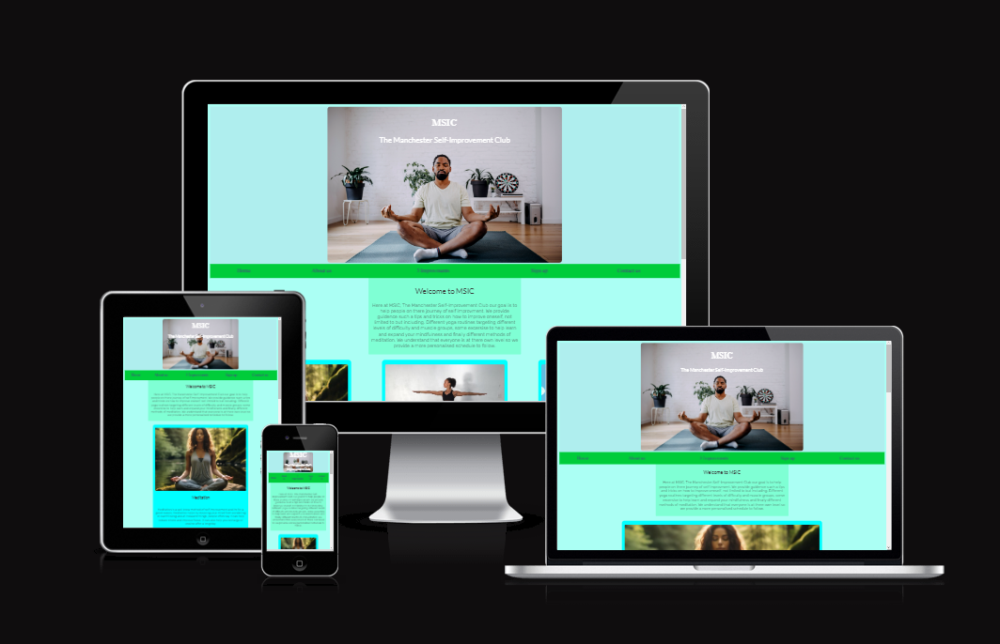

<h1>The Manchester Self-Improvement Club</h1>
The Manchester Self-Improvement Club or MISC for short is a landing page for people looking to improve themselves. The MISC offer a guide in 3 different methods of self-improvement

Users of this website will be able to learn more about the 3 methods: what benifits they can expect, what area each of the methods with cover, contact information and a sign up form. The site is targeted towards people who want to learn more about self-improvement.

    

    

<h2>UX</h2>
The target audience for MSIC are:
<ul>People who want to improve themselves but dont know where to start
<li>People that suffer for anxiety or anxiousness
<li>People who want to explore the benifits of the 3 practices
<li>People that want to change some habits of there life
</ul>
User goals are:
<ul>
<li>Learn more about the 3 practices
<li>Develop better and healthier habits in there life
<li>
<li>
</ul>
<h1>Deployment</h1>
<h1>Testing</h1>
<h1>Wireframes</h1>
<ul>
<li>
<li>
<li>
<li>
</ul>